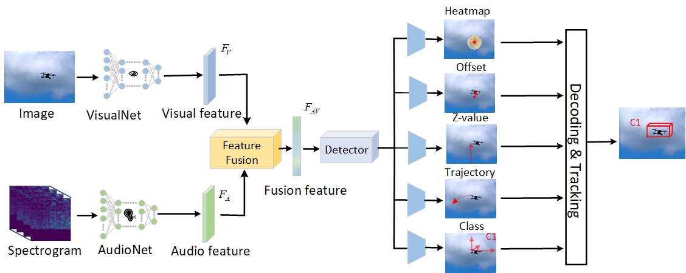

# <div align="center">AV-FDTI: Audio-visual fusion for drone threat identification</div>

<div align="center">
    
</div>

<div align="center">
<p>This repo presents the codes for AV-FDTI: Audio-visual fusion for drone threat identification, which aims to fuse audio and vision data for effective drone classification adn localization</p>
</div>

## Dependencies

- **PyTorch**: `pytorch`, `torchaudio`, `torchvision`
- **OpenCV**: `opencv-python`
- **Utilities**:
  - `tqdm`
  - `scikit-learn`
  - `seaborn`

## Train
Go to config/train_config.py to modify the hyperparameters, and then run:
```bash
$ python antidrone_training_multihead.py
```

## Test
Go to config/test_config.py to modify the hyperparameters, and then run:
```bash
$ python test.py
```
## Note
The data for the experiments are from [MMAUD datasets](https://github.com/ntu-aris/MMAUD), the corresponding paper can be found [here](https://arxiv.org/abs/2402.03706)

## Cite
```bash
@article{yang2024av,
  title={AV-FDTI: Audio-visual fusion for drone threat identification},
  author={Yang, Yizhuo and Yuan, Shenghai and Yang, Jianfei and Nguyen, Thien Hoang and Cao, Muqing and Nguyen, Thien-Minh and Wang, Han and Xie, Lihua},
  journal={Journal of Automation and Intelligence},
  volume={3},
  number={3},
  pages={144--151},
  year={2024},
  publisher={Elsevier}
}

@article{yuan2024mmaud,
  title={MMAUD: A Comprehensive Multi-Modal Anti-UAV Dataset for Modern Miniature Drone Threats},
  author={Yuan, Shenghai and Yang, Yizhuo and Nguyen, Thien Hoang and Nguyen, Thien-Minh and Yang, Jianfei and Liu, Fen and Li, Jianping and Wang, Han and Xie, Lihua},
  journal={arXiv preprint arXiv:2402.03706},
  year={2024}
}
```
